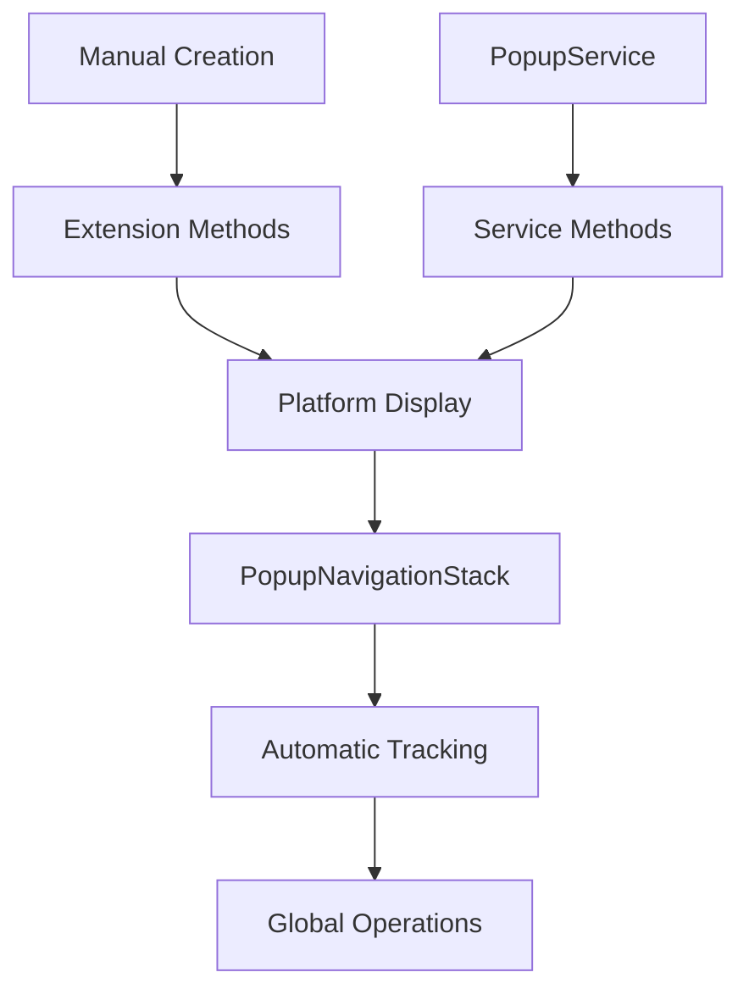

# Popups for .NET MAUI

---

## About

This small private library is built on top of CommunityToolkit popups version 1, code no longer used by the toolkit itself.  It was the fastest for opening popups among different libraries, was definitely worth adding a navigation stack, HotReload support, IgnoreSafeArea and a separate dimmer layer for all platforms.

---

## To Do

### Required

* Test orientation changes when already open
* Android anchor is acting lower by the amount for either bottom navbar or shell navbar, need to investigate
* Test and possibly fix Tizen

### Roadmap

* Add Blur effect below
* Add background layer custom content
* Add animations like we had in RG popups, working separately separate for overlay and content

---

## Popup Layers
When rendered your popup is using 2 layers:

* Background dimmer layer, can be totally transparent or dim your background under popup
* Popup content

### Background Layer

At all times you have a background layer filling the entire screen, layout properties will not affect it. You can change it's color by setting BackgroundColor of the popup, for example:

```xml
BackgroundColor="#66000000"
```

would create a semi-transparent dimmer.

You can hide the layer by setting popup `BackgroundColor` property to a totally transparent color.

### Popup Content

This is your logical popup, layout properties like `HorizontalOptions`, `VerticalOptions` will affect its positioning.

`IgnoreSafeArea` controls if you want to consider full screen or not to go over safe insets, like status bar etc.

## Gestures

When `CloseWhenBackgroundIsClicked` is set to `true` then tapping somewhere where gestures are not user-handled will close your popup.

## Anchor Positioning

You can position popups relative to specific UI elements. This is particularly useful for context menus, tooltips, or dropdowns that should appear next to buttons or other controls.

When you set the `Anchor` property of a popup to reference another view, the popup will be positioned relative to that anchor element instead of using the standard alignment properties (`HorizontalOptions`, `VerticalOptions`).

First, give your anchor element a name:

```xml
<Button x:Name="AnchoredButton" 
        Text="Show Anchored Popup" 
        Clicked="OnAnchoredPopupClicked" />
```

Then set the anchor when showing the popup:

```csharp
private async void OnAnchoredPopupClicked(object sender, EventArgs e)
{
    var popup = new AnchoredPopup();
    popup.Anchor = AnchoredButton; // Reference the button
    await this.ShowPopupAsync(popup);
}
```

---

## API Reference

### Three Ways to Work with Popups

AppoMobi.Maui.Popups provides three complementary approaches for different scenarios:

#### 1. 🎯 Manual Popup Creation (Direct Approach)
Perfect for simple popups and full control:

```csharp
// Create popup manually
var popup = new Popup
{
    Content = new Label { Text = "Hello World!" },
    HeightRequest = 200,
    WidthRequest = 300,
    CloseWhenBackgroundIsClicked = true
};

// Show popup using extension methods
var result = await this.ShowPopupAsync(popup);
// OR
this.ShowPopup(popup);
```

**When to use:** Simple popups, prototyping, full control over properties

#### 2. 🏗️ PopupService (Dependency Injection Approach)
Best for MVVM architecture and complex applications:

```csharp
// Register in MauiProgram.cs
builder.Services.AddTransientPopup<MyPopup, MyPopupViewModel>();

// Inject and use
public class MyPageViewModel
{
    private readonly IPopupService popupService;

    public async Task ShowMyPopup()
    {
        // Service creates popup + viewmodel automatically
        var result = await popupService.ShowPopupAsync<MyPopupViewModel>();

        // OR with initialization
        var result2 = await popupService.ShowPopupAsync<MyPopupViewModel>(vm =>
        {
            vm.Title = "Custom Title";
            vm.LoadData();
        });
    }
}
```

**When to use:** MVVM pattern, dependency injection, automatic ViewModel creation

#### 3. 🗂️ PopupNavigationStack (Global Stack Management)
Automatic tracking and global operations for all popups:

```csharp
// Access the global navigation stack (works with ANY popup approach)
var stackCount = PopupNavigationStack.Instance.Count;
var topPopup = PopupNavigationStack.Instance.Peek();

// Global operations
PopupNavigationStack.Instance.Clear(); // Close all popups
var popup = PopupNavigationStack.Instance.Pop(); // Get and remove top popup
```

**When to use:** Managing multiple popups, global operations, navigation-like experiences

---

### How They Work Together

All three approaches work seamlessly together:



**Key Points:**
- ✅ **All popups are automatically tracked** in NavigationStack regardless of creation method
- ✅ **Mix and match approaches** - use what fits each scenario
- ✅ **Global operations work on all popups** - close all, peek, count, etc.
- ✅ **Automatic cleanup** - popups are removed from stack when closed

---

### Popup Properties Reference

```csharp
var popup = new Popup
{
    // Content and layout
    Content = new Label { Text = "Hello World" },
    HeightRequest = 200,
    WidthRequest = 300,
    HorizontalOptions = LayoutOptions.Center,
    VerticalOptions = LayoutOptions.Center,

    // Background and overlay
    BackgroundColor = Colors.Black.WithAlpha(0.5f), // Semi-transparent dimmer
    Color = Colors.White, // Popup content background

    // Behavior
    CloseWhenBackgroundIsClicked = true,
    IgnoreSafeArea = false,

    // Positioning
    Anchor = someButton, // Position relative to this element

    // Results
    ResultWhenUserTapsOutsideOfPopup = "cancelled"
};
```

---

## Detailed Usage Guide

### Setup and Configuration

#### Basic Setup (Required for all approaches)
```csharp
public static class MauiProgram
{
    public static MauiApp CreateMauiApp()
    {
        var builder = MauiApp.CreateBuilder();
        builder
            .UseMauiApp<App>()
            .AddPopups(); // Configure popup handlers - REQUIRED

        return builder.Build();
    }
}
```

#### PopupService Setup (Optional - only if using dependency injection)
```csharp
public static class MauiProgram
{
    public static MauiApp CreateMauiApp()
    {
        var builder = MauiApp.CreateBuilder();
        builder
            .UseMauiApp<App>()
            .AddPopups(); // Configure popup handlers

        // Register popup service (optional)
        builder.Services.AddSingleton<IPopupService, PopupService>();

        // Register popup/viewmodel pairs (optional)
        builder.Services.AddTransientPopup<MyPopup, MyPopupViewModel>();
        builder.Services.AddTransientPopup<ConfirmDialog, ConfirmDialogViewModel>();

        return builder.Build();
    }
}
```

### Manual Popup Creation Examples

#### Simple Message Popup
```csharp
public async Task ShowMessage(string message)
{
    var popup = new Popup
    {
        Content = new StackLayout
        {
            Children =
            {
                new Label { Text = message, HorizontalOptions = LayoutOptions.Center },
                new Button
                {
                    Text = "OK",
                    Command = new Command(() => popup.Close("ok"))
                }
            }
        },
        HeightRequest = 150,
        WidthRequest = 300,
        CloseWhenBackgroundIsClicked = true
    };

    var result = await this.ShowPopupAsync(popup);
}
```

#### Anchored Popup (Context Menu Style)
```csharp
private async void OnButtonClicked(object sender, EventArgs e)
{
    var button = (Button)sender;

    var popup = new Popup
    {
        Anchor = button, // Position relative to button
        Content = new StackLayout
        {
            Children =
            {
                new Button { Text = "Option 1" },
                new Button { Text = "Option 2" },
                new Button { Text = "Option 3" }
            }
        },
        CloseWhenBackgroundIsClicked = true,
        BackgroundColor = Colors.Transparent // No dimming
    };

    await this.ShowPopupAsync(popup);
}
```

### PopupService Examples

#### Basic Service Usage
```csharp
public class MyPageViewModel
{
    private readonly IPopupService popupService;

    public MyPageViewModel(IPopupService popupService)
    {
        this.popupService = popupService;
    }

    public async Task ShowConfirmation()
    {
        // Service creates popup + viewmodel automatically
        var result = await popupService.ShowPopupAsync<ConfirmationViewModel>();

        if (result?.ToString() == "confirmed")
        {
            // User confirmed action
        }
    }

    public async Task ShowCustomDialog()
    {
        // Initialize viewmodel before showing
        var result = await popupService.ShowPopupAsync<DialogViewModel>(vm =>
        {
            vm.Title = "Custom Title";
            vm.Message = "Are you sure you want to delete this item?";
            vm.LoadData();
        });
    }
}
```

### PopupNavigationStack Examples

The NavigationStack automatically tracks ALL popups regardless of how they were created:

#### Basic Stack Operations
```csharp
// Check current state
var stackCount = PopupNavigationStack.Instance.Count;
var topPopup = PopupNavigationStack.Instance.Peek();

// Global operations (works with ANY popup)
PopupNavigationStack.Instance.Clear(); // Close all popups
var popup = PopupNavigationStack.Instance.Pop(); // Get and remove top popup

// The stack is thread-safe and automatically maintained
```

#### Advanced Stack Management
```csharp
public class PopupManager
{
    public async Task ShowWizardFlow()
    {
        // Show multiple popups in sequence (any creation method)
        var step1 = new Step1Popup();
        await this.ShowPopupAsync(step1);

        var step2 = new Step2Popup();
        await this.ShowPopupAsync(step2);

        var step3 = new Step3Popup();
        await this.ShowPopupAsync(step3);

        // NavigationStack now contains all 3 popups automatically
        Console.WriteLine($"Popups in stack: {PopupNavigationStack.Instance.Count}");
    }

    public void HandleBackButton()
    {
        if (PopupNavigationStack.Instance.Count > 0)
        {
            // Close the topmost popup (like back navigation)
            var topPopup = PopupNavigationStack.Instance.Pop();
            topPopup?.Close();
        }
        else
        {
            // Handle normal back navigation
            Shell.Current.GoToAsync("..");
        }
    }

    public void HandleEmergencyExit()
    {
        // Close all popups immediately (works with any popup type)
        PopupNavigationStack.Instance.Clear();
    }
}
```

#### Using with PopupService
```csharp
public class ServiceBasedManager
{
    private readonly IPopupService popupService;

    public ServiceBasedManager(IPopupService popupService)
    {
        this.popupService = popupService;
    }

    public async Task ShowMultipleDialogs()
    {
        // Use service to show popups
        await popupService.ShowPopupAsync<ConfirmationViewModel>();
        await popupService.ShowPopupAsync<InputViewModel>();

        // NavigationStack tracks them automatically
        var count = PopupNavigationStack.Instance.Count;

        // Use service methods for stack operations
        popupService.CloseTopPopup();
        popupService.CloseAllPopups();
    }
}
```

---

## Key Features Summary

### NavigationStack Features
- ✅ **Thread-Safe**: All operations are thread-safe with internal locking
- ✅ **Automatic Management**: Popups are automatically added/removed from stack
- ✅ **Universal Tracking**: Works with manual creation, PopupService, and extension methods
- ✅ **LIFO Behavior**: Last-In-First-Out like a standard navigation stack
- ✅ **Bulk Operations**: Close multiple popups efficiently
- ✅ **Stack Inspection**: Peek at the top popup without removing it
- ✅ **Global Access**: Static singleton accessible from anywhere

### When to Use Each Approach

| Approach | Best For | Example Use Cases |
|----------|----------|-------------------|
| **Manual Creation** | Simple popups, prototyping, full control | Alert messages, simple confirmations, quick demos |
| **PopupService** | MVVM apps, dependency injection, complex logic | User forms, data entry, business workflows |
| **NavigationStack** | Multi-popup scenarios, global management | Wizard flows, modal stacks, emergency exits |

### Mixing Approaches
```csharp
public class MixedUsageExample
{
    private readonly IPopupService popupService;

    public async Task DemonstrateAllApproaches()
    {
        // 1. Manual creation
        var simplePopup = new Popup { Content = new Label { Text = "Simple" } };
        await this.ShowPopupAsync(simplePopup);

        // 2. Service-based
        await popupService.ShowPopupAsync<ComplexViewModel>();

        // 3. Global stack operations work on ALL popups
        var totalPopups = PopupNavigationStack.Instance.Count; // Shows 2
        PopupNavigationStack.Instance.Clear(); // Closes both
    }
}
```

---

## Advanced Usage

### Custom Popup Behavior

#### Custom Validation

Override `OnBackgroundClicked()` to implement custom dismissal logic:

```csharp
public class ConfirmationPopup : Popup
{
    public bool HasUnsavedChanges { get; set; }

    public override bool OnBackgroundClicked()
    {
        if (HasUnsavedChanges)
        {
            // Show confirmation dialog or prevent closing
            return false; // Prevent dismissal
        }

        return true; // Allow dismissal
    }
}
```

#### Popup Lifecycle Events

```csharp
public class MyPopup : Popup
{
    protected override void OnOpened()
    {
        base.OnOpened();
        // Popup has been displayed
        StartAnimations();
    }

    protected override async Task OnClosed(object? result, bool wasDismissedByTappingOutside, CancellationToken token)
    {
        // Popup is about to close
        await SaveData();
        await base.OnClosed(result, wasDismissedByTappingOutside, token);
    }
}
```

### Platform-Specific Features

#### Consistent Cross-Platform Behavior

The library ensures consistent popup dismissal behavior across all platforms:

- **Android**: Uses overlay click detection with proper touch handling
- **iOS**: Uses `UITapGestureRecognizer` with unified validation
- **Windows**: Uses `PointerPressed` events with consistent logic
- **Tizen**: Uses native outside click events

All platforms now use the same validation logic through `ShouldDismissOnOutsideClick()`.

#### Platform Handlers

Custom platform handlers provide enhanced performance and reliability:

```csharp
// In MauiProgram.cs
builder.ConfigurePopups(); // Registers enhanced platform handlers
```

### Advanced Usage Examples

#### Modal Dialog with Result

```csharp
public class ConfirmDialog : Popup
{
    public ConfirmDialog(string message)
    {
        Content = new StackLayout
        {
            Children =
            {
                new Label { Text = message },
                new Button
                {
                    Text = "OK",
                    Command = new Command(() => Close("confirmed"))
                },
                new Button
                {
                    Text = "Cancel",
                    Command = new Command(() => Close("cancelled"))
                }
            }
        };

        CloseWhenBackgroundIsClicked = false; // Force button interaction
        ResultWhenUserTapsOutsideOfPopup = "cancelled";
    }
}

// Usage
var dialog = new ConfirmDialog("Are you sure?");
var result = await this.ShowPopupAsync(dialog);
if (result?.ToString() == "confirmed")
{
    // User confirmed
}
```

#### Context Menu

```csharp
public class ContextMenu : Popup
{
    public ContextMenu(IView anchor, List<MenuItem> items)
    {
        Anchor = anchor;
        CloseWhenBackgroundIsClicked = true;
        BackgroundColor = Colors.Transparent; // No dimming

        Content = new CollectionView
        {
            ItemsSource = items,
            ItemTemplate = new DataTemplate(() =>
            {
                var label = new Label();
                label.SetBinding(Label.TextProperty, "Title");
                return new ViewCell { View = label };
            })
        };
    }
}
```

#### Loading Overlay

```csharp
public class LoadingPopup : Popup
{
    public LoadingPopup()
    {
        CloseWhenBackgroundIsClicked = false;
        BackgroundColor = Colors.Black.WithAlpha(0.7f);

        Content = new StackLayout
        {
            HorizontalOptions = LayoutOptions.Center,
            VerticalOptions = LayoutOptions.Center,
            Children =
            {
                new ActivityIndicator { IsRunning = true },
                new Label { Text = "Loading...", TextColor = Colors.White }
            }
        };
    }
}
```

---

