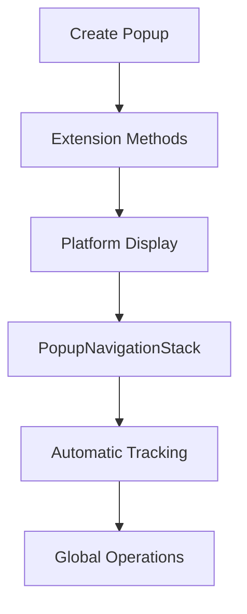

# FastPopups for .NET MAUI

**Simple and fast popups library for .NET MAUI**

## About

Initially built on top of CommunityToolkit popups version one, it was found to be the fastest for opening popups among different libraries, was definitely worth adding new features like full-screen, navigation stack, hotreload support, animations, and much more.

---

## ✨ Key Features

- **🛝 Crossplatform**: iOS, MacCatalyst, Android, Windows
- **↕️ Full Screen**: Choose to display content in safe area or full screen
- **🌖 Overlay Customization**: Configurable colors and transparency
- **🗂️ Navigation Stack**: Thread-safe automatic tracking of all popups
- **📍 Flexible Positioning**: Anchored ot aligned positioning
- **👆 Dismissal Options**: Tap-outside-to-dismiss with custom validation
- **📐 Padding Support**: Built-in content padding to limit filling content
- **💪 Multiplatform consistency**: Same behavior on all platforms
- **🔄 HotReload Support**: Preview changes in realtime
---

## ⬆️ What's New 1.1.0.1

- Animations! See sample app.

---

## Intro

We have 2 layers here: background dimmer and popup content. You can customize the dimmer by setting `BackgroundColor` of the popup and control the level of tint and transparency. This one will cover all the screen.  
When you set popup's layout/padding/anchor properties you are controlling the content. Animations are separate for dimmer and content, first one only uses fade and content is fully animated upon settings, please see below.  
If you need to wait until the popup is closed use `ShowPopupAsync` it can even return a result. For a fire a forget scenario use `Show`. But wait.. better read the full docs, no?

## 🚀 Quick Start

### Setup 

**Install from nuget:**
```bash
dotnet add package AppoMobi.Maui.FastPopups
```

**Initilalize:**

```csharp
using FastPopups;

public static class MauiProgram
{
    public static MauiApp CreateMauiApp()
    {
        var builder = MauiApp.CreateBuilder();
        builder
            .UseMauiApp<App>()
            .AddPopups(); // That's it! 🎉

        return builder.Build();
    }
}
```

When in any doubt check out the included `SampleApp` project!

### Create and Show Popups
```csharp
// Simple popup
var popup = new Popup
{
    Content = new Label { Text = "Hello World!" },
    HeightRequest = 200,
    WidthRequest = 300
};

await this.ShowPopupAsync(popup);

// MVVM popup
var popup = new UserProfilePopup
{
    BindingContext = new UserProfileViewModel(user)
};

await this.ShowPopupAsync(popup);

// Global operations
PopupNavigationStack.Instance.CloseTop(); // Close top popup
PopupNavigationStack.Instance.Clear(); // Close all popups
var count = PopupNavigationStack.Instance.Count; // How many open?
```

---

## Popup Layers
When rendered your popup is using 2 layers:

* Background dimmer layer, can be totally transparent or dim your background under popup
* Popup content

### Background Layer

At all times you have a background layer filling the entire screen, layout properties will not affect it. You can change it's color by setting BackgroundColor of the popup, for example:

```xml
BackgroundColor="#66000000"
```

would create a semi-transparent dimmer.

You can hide the layer by setting popup `BackgroundColor` property to a totally transparent color.

### Popup Content

This is your logical popup, layout properties like `HorizontalOptions`, `VerticalOptions` will affect its positioning.

`IsFullScreen` controls if you want to consider full screen or not to go over safe insets, like status bar etc.

### Padding

The `Padding` property creates internal spacing within your popup, reducing the available content area. This is useful for creating visual breathing room around your content.

```csharp
var popup = new Popup
{
    Content = new Label { Text = "Content with padding" },
    Padding = new Thickness(50), // 50 pts padding on all sides
    BackgroundColor = Colors.Red, // You'll see the red border around content
    IsFullScreen = true
};

// Or specify different padding for each side
popup.Padding = new Thickness(left: 10, top: 20, right: 10, bottom: 20);
```

**Key Points:**
- ✅ **Content-only**: Padding affects content positioning/sizing, not the background overlay
- ✅ **Cross-platform**: Works consistently on Windows, iOS, Android, and other platforms
- ✅ **Visual spacing**: Creates clean borders between content and popup edges
- ✅ **Layout aware**: Works with all layout options (Fill, Center, Start, End)

## Animations

FastPopups supports platform-native animations for both appearing and hiding transitions.   
You can customize animation type, duration, for some types changing easing curves is also possible.  
Best demonstrated in the included SampleApp.
Dimmer layer and Content are separately animated, with dimmer fading in/out and content using the selected animation type.  


### Animation Types

Available animation types:
- **Fade** - Simple fade in/out
- **Bottom/Top/Left/Right** - Slide from edges
- **SprintBottom/SprintTop/SprintLeft/SprintRight** - Slide with elastic overshoot effect and fade.
- **ZoomIn/ZoomOut** - Scale animations
- **Whirl** - Rotate + scale effect
- **BounceIn/BounceInHorizontal/BounceInVertical** - Bounce-in from small (0.5→1.1→1.0)
- **BounceOut/BounceOutHorizontal/BounceOutVertical** - Opposite of BounceIn - bounces in from large (1.5→0.9→1.0) and out to large (1.0→1.1→1.5)
- **FlipHorizontal/FlipVertical** - 3D flip animations

### Animation Properties

```csharp
var popup = new Popup
{
    Content = myContent,
    AnimationType = PopupAnimationType.SprintBottom, // Animation style
    AnimationDuration = 300, // Duration in milliseconds
    AnimationEasing = PopupAnimationEasing.Decelerate // Easing curve
};
```

### Animation Easing Options

The `AnimationEasing` property controls how the animation accelerates and decelerates:

- **Default** - Platform-specific default (Decelerate for show, Accelerate for hide)
- **Linear** - Constant speed throughout
- **Decelerate** - Fast start, slow end (ease-out)
- **Accelerate** - Slow start, fast end (ease-in)
- **AccelerateDecelerate** - Slow-fast-slow S-curve (ease-in-out)
- **Spring** - Spring physics with overshoot
- **Elastic** - Elastic bounce effect

### Cross-Platform Consistency

Animations are implemented using native platform APIs for optimal performance:
- **iOS/macOS**: `UIViewPropertyAnimator` with timing curves
- **Android**: `ObjectAnimator` with interpolators
- **Windows**: XAML `Storyboard` with easing functions

Despite using different native APIs, the visual appearance is consistent across all platforms.

## Gestures

When `CloseWhenBackgroundIsClicked` is set to `true` then tapping somewhere where gestures are not user-handled will close your popup.
You can override `OnBackgroundClicked` to return false to block closing.

## Anchor Positioning

You can position popups relative to specific UI elements. This is particularly useful for context menus, tooltips, or dropdowns that should appear next to buttons or other controls.

When you set the `Anchor` property of a popup to reference another view, the popup will be positioned relative to that anchor element instead of using the standard alignment properties (`HorizontalOptions`, `VerticalOptions`).

First, give your anchor element a name:

```xml
<Button x:Name="AnchoredButton" 
        Text="Show Anchored Popup" 
        Clicked="OnAnchoredPopupClicked" />
```

Then set the anchor when showing the popup:

```csharp
private async void OnAnchoredPopupClicked(object sender, EventArgs e)
{
    var popup = new AnchoredPopup();
    popup.Anchor = AnchoredButton; // Reference the button
    await this.ShowPopupAsync(popup);
}
```

---

## Usage Guide

### Simple Setup (One Line!)

```csharp
public static class MauiProgram
{
    public static MauiApp CreateMauiApp()
    {
        var builder = MauiApp.CreateBuilder();
        builder
            .UseMauiApp<App>()
            .AddPopups(); // That's it! 🎉

        return builder.Build();
    }
}
```

### Popup Creation Examples

#### Simple Message Popup
```csharp
public async Task ShowMessage(string message)
{
    var popup = new Popup
    {
        Content = new StackLayout
        {
            Children =
            {
                new Label { Text = message, HorizontalOptions = LayoutOptions.Center },
                new Button
                {
                    Text = "OK",
                    Command = new Command(() => popup.Close("ok"))
                }
            }
        },
        HeightRequest = 150,
        WidthRequest = 300,
        Padding = new Thickness(20), // Add 20px padding around content
        CloseWhenBackgroundIsClicked = true
    };

    var result = await this.ShowPopupAsync(popup);
}
```

#### Popup with Custom Padding
```csharp
public async Task ShowPaddedDialog()
{
    var popup = new Popup
    {
        Content = new Frame
        {
            BackgroundColor = Colors.White,
            Content = new Label
            {
                Text = "This content has custom padding!",
                HorizontalOptions = LayoutOptions.Center,
                VerticalOptions = LayoutOptions.Center
            }
        },
        Padding = new Thickness(30, 50, 30, 20), // Different padding per side
        BackgroundColor = Colors.Black.WithAlpha(0.7f),
        IsFullScreen = true,
        CloseWhenBackgroundIsClicked = true
    };

    await this.ShowPopupAsync(popup);
}
```

#### Anchored Popup (Context Menu Style)
```csharp
private async void OnButtonClicked(object sender, EventArgs e)
{
    var button = (Button)sender;

    var popup = new Popup
    {
        Anchor = button, // Position relative to button
        Content = new StackLayout
        {
            Children =
            {
                new Button { Text = "Option 1" },
                new Button { Text = "Option 2" },
                new Button { Text = "Option 3" }
            }
        },
        CloseWhenBackgroundIsClicked = true,
        BackgroundColor = Colors.Transparent // No dimming
    };

    await this.ShowPopupAsync(popup);
}
```

#### MVVM Pattern Example
```csharp
public class MyPageViewModel
{
    public async Task ShowConfirmation()
    {
        // Create popup with ViewModel
        var popup = new ConfirmationPopup
        {
            BindingContext = new ConfirmationViewModel
            {
                Title = "Confirm Action",
                Message = "Are you sure you want to delete this item?"
            },
            HeightRequest = 200,
            WidthRequest = 400
        };

        var result = await Application.Current.MainPage.ShowPopupAsync(popup);

        if (result?.ToString() == "confirmed")
        {
            // User confirmed action
        }
    }

    public async Task ShowComplexDialog()
    {
        // For complex ViewModels, create separately
        var viewModel = new DialogViewModel();
        viewModel.LoadData();
        viewModel.Title = "Custom Title";

        var popup = new DialogPopup
        {
            BindingContext = viewModel,
            HeightRequest = 400,
            WidthRequest = 500
        };

        var result = await Application.Current.MainPage.ShowPopupAsync(popup);
    }
}
```

### PopupNavigationStack Examples

The NavigationStack automatically tracks ALL popups regardless of how they were created:

#### Basic Stack Operations
```csharp
// Check current state
var stackCount = PopupNavigationStack.Instance.Count;
var topPopup = PopupNavigationStack.Instance.Peek();

// Global operations (works with ANY popup)
PopupNavigationStack.Instance.Clear(); // Close all popups
var popup = PopupNavigationStack.Instance.Pop(); // Get and remove top popup

// The stack is thread-safe and automatically maintained
```

#### Advanced Stack Management
```csharp
public class PopupManager
{
    public async Task ShowWizardFlow()
    {
        // Show multiple popups in sequence (any creation method)
        var step1 = new Step1Popup();
        await this.ShowPopupAsync(step1);

        var step2 = new Step2Popup();
        await this.ShowPopupAsync(step2);

        var step3 = new Step3Popup();
        await this.ShowPopupAsync(step3);

        // NavigationStack now contains all 3 popups automatically
        Console.WriteLine($"Popups in stack: {PopupNavigationStack.Instance.Count}");
    }

    public void HandleBackButton()
    {
        if (PopupNavigationStack.Instance.Count > 0)
        {
            // Close the topmost popup (like back navigation)
            var topPopup = PopupNavigationStack.Instance.Pop();
            topPopup?.Close();
        }
        else
        {
            // Handle normal back navigation
            Shell.Current.GoToAsync("..");
        }
    }

    public void HandleEmergencyExit()
    {
        // Close all popups immediately (works with any popup type)
        PopupNavigationStack.Instance.Clear();
    }
}
```

#### Multiple Popups Example
```csharp
public class PopupManager
{
    public async Task ShowMultipleDialogs()
    {
        // Show multiple popups - all automatically tracked
        var confirmation = new ConfirmationPopup();
        await Application.Current.MainPage.ShowPopupAsync(confirmation);

        var input = new InputPopup();
        await Application.Current.MainPage.ShowPopupAsync(input);

        // NavigationStack tracks them automatically
        var count = PopupNavigationStack.Instance.Count;

        // Global stack operations
        PopupNavigationStack.Instance.Clear(); // Close all
    }

    public void HandleBackButton()
    {
        // Close top popup on back button
        if (PopupNavigationStack.Instance.Count > 0)
        {
            var topPopup = PopupNavigationStack.Instance.Pop();
            topPopup?.Close();
        }
    }
}
```

---

## Key Features Summary

### 🎯 **Simple & Powerful**
- ✅ **One-line setup** - Just `.AddPopups()` and you're ready
- ✅ **Direct creation** - `new MyPopup()` - no magic, no complexity
- ✅ **Full control** - Customize every aspect of your popups
- ✅ **MVVM friendly** - Works perfectly with ViewModels and data binding
- ✅ **No dependencies** - No services to inject or register

### 🗂️ **NavigationStack Features**
- ✅ **Thread-Safe**: All operations are thread-safe with internal locking
- ✅ **Automatic Management**: Popups are automatically added/removed from stack
- ✅ **Universal Tracking**: Works with all popup creation methods
- ✅ **LIFO Behavior**: Last-In-First-Out like a standard navigation stack
- ✅ **Bulk Operations**: Close multiple popups efficiently
- ✅ **Stack Inspection**: Peek at the top popup without removing it
- ✅ **Global Access**: Static singleton accessible from anywhere

### Why This Approach

| ✅ **Simplified** | ❌ **Complex Alternatives** |
|------------------|----------------------------|
| **One line setup** - Just `.AddPopups()` | Multiple service registrations |
| **Direct creation** - `new MyPopup()` | Magic string mappings |
| **Full control** - Customize everything | Limited by service patterns |
| **Easy debugging** - See exactly what happens | Hidden service magic |
| **No dependencies** - Just create and show | Inject services everywhere |

### Real-World Usage
```csharp
public class RealWorldExample
{
    public async Task ShowUserProfile(User user)
    {
        // Simple, direct, powerful
        var popup = new UserProfilePopup
        {
            BindingContext = new UserProfileViewModel(user),
            HeightRequest = 500,
            WidthRequest = 400,
            CloseWhenBackgroundIsClicked = true
        };

        var result = await Application.Current.MainPage.ShowPopupAsync(popup);

        // NavigationStack automatically tracked everything
        Console.WriteLine($"Popups in stack: {PopupNavigationStack.Instance.Count}");
    }

    public void CloseAllPopups()
    {
        // Global operations work seamlessly
        PopupNavigationStack.Instance.Clear();
    }
}
```

---

## Advanced Usage

### Custom Validation

Override `OnBackgroundClicked()` to implement custom dismissal logic:

```csharp
public class ConfirmationPopup : Popup
{
    public bool HasUnsavedChanges { get; set; }

    public override bool OnBackgroundClicked()
    {
        if (HasUnsavedChanges)
        {
            // Show confirmation dialog or prevent closing
            return false; // Prevent dismissal
        }

        return true; // Allow dismissal
    }
}
```

## Examples

### Modal Dialog with Result

```csharp
public class ConfirmDialog : Popup
{
    public ConfirmDialog(string message)
    {
        Content = new StackLayout
        {
            Children =
            {
                new Label { Text = message },
                new Button
                {
                    Text = "OK",
                    Command = new Command(() => Close("confirmed"))
                },
                new Button
                {
                    Text = "Cancel",
                    Command = new Command(() => Close("cancelled"))
                }
            }
        };

        CloseWhenBackgroundIsClicked = false; // Force button interaction
        ResultWhenUserTapsOutsideOfPopup = "cancelled";
    }
}

// Usage
var dialog = new ConfirmDialog("Are you sure?");
var result = await this.ShowPopupAsync(dialog);
if (result?.ToString() == "confirmed")
{
    // User confirmed
}
```

### Context Menu

```csharp
public class ContextMenu : Popup
{
    public ContextMenu(IView anchor, List<MenuItem> items)
    {
        Anchor = anchor;
        CloseWhenBackgroundIsClicked = true;
        BackgroundColor = Colors.Transparent; // No dimming

        Content = new CollectionView
        {
            ItemsSource = items,
            ItemTemplate = new DataTemplate(() =>
            {
                var label = new Label();
                label.SetBinding(Label.TextProperty, "Title");
                return new ViewCell { View = label };
            })
        };
    }
}
```

### Loading Overlay

```csharp
public class LoadingPopup : Popup
{
    public LoadingPopup()
    {
        CloseWhenBackgroundIsClicked = false;
        BackgroundColor = Colors.Black.WithAlpha(0.7f);

        Content = new StackLayout
        {
            HorizontalOptions = LayoutOptions.Center,
            VerticalOptions = LayoutOptions.Center,
            Children =
            {
                new ActivityIndicator { IsRunning = true },
                new Label { Text = "Loading...", TextColor = Colors.White }
            }
        };
    }
}
```

---

## API Reference

### Two Simple Ways to Work with Popups

AppoMobi.Maui.FastPopups provides a clean, simple approach with two complementary parts:

#### 1. 🎯 Create and Show Popups (Direct Approach)
Simple, powerful, and gives you full control:

```csharp
// Create popup manually
var popup = new Popup
{
    Content = new Label { Text = "Hello World!" },
    HeightRequest = 200,
    WidthRequest = 300,
    CloseWhenBackgroundIsClicked = true
};

// Show popup using extension methods
var result = await this.ShowPopupAsync(popup);
// OR
this.ShowPopup(popup);
```

**Perfect for:** All scenarios - simple messages, complex forms, MVVM patterns, everything!

#### 2. 🗂️ PopupNavigationStack (Global Stack Management)
Automatic tracking and global operations for all popups:

```csharp
// Access the global navigation stack (automatically tracks ALL popups)
var stackCount = PopupNavigationStack.Instance.Count;
var topPopup = PopupNavigationStack.Instance.Peek();

// Global operations
PopupNavigationStack.Instance.Clear(); // Close all popups
var popup = PopupNavigationStack.Instance.Pop(); // Get and remove top popup
```

**Perfect for:** Managing multiple popups, global operations, navigation-like experiences

---

### How They Work Together

Both parts work seamlessly together:



**Key Points:**
- ✅ **All popups are automatically tracked** in NavigationStack
- ✅ **Simple and powerful** - no complex setup or registration needed
- ✅ **Global operations work on all popups** - close all, peek, count, etc.
- ✅ **Automatic cleanup** - popups are removed from stack when closed
- ✅ **Full control** - customize every aspect of your popups

---

### Popup Properties Reference

```csharp
var popup = new Popup
{
    // Content and layout
    Content = new Label { Text = "Hello World" },
    HeightRequest = 200,
    WidthRequest = 300,
    HorizontalOptions = LayoutOptions.Center,
    VerticalOptions = LayoutOptions.Center,

    // Background and overlay
    BackgroundColor = Colors.Black.WithAlpha(0.5f), // Semi-transparent dimmer
    Color = Colors.White, // Popup content background

    // Spacing and padding
    Padding = new Thickness(20), // 20px padding on all sides
    // or Padding = new Thickness(10, 20, 10, 20), // left, top, right, bottom

    // Behavior
    CloseWhenBackgroundIsClicked = true,
    IsFullScreen = false,

    // Positioning
    Anchor = someButton, // Position relative to this element

    // Results
    ResultWhenUserTapsOutsideOfPopup = "cancelled"
};
```

---

Please feel free to contribute! The next lib improvement might be to add more background layer customization, mainly thinking about blurring te background with it, instead of placing a blurred screenshot inside the content - what I am actually doing when needed.

